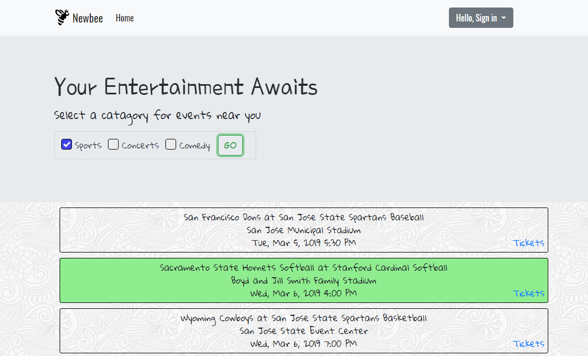

# Newbee App

## Overview
Looking for some Entertainment, but don't know where to look?
Look no further...
Newbee App lets you find events near you!
Easily search local sporting events, concerts, and comedy shows within your current location. Select the categorie(s) you're interested and hit the "GO" button. Newbee will generate a list of events in your area!
Find an event you like and when you click on it, that event will be saved to "My Events". 
In "My Events" you can easily track the events you're interested in and find tickets by clicking the link to the right of the event. 
Now get out there and have some fun!

## Problem Addressed
- Users are looking for a quick and easy way to find local events.
## Technical Approach
- We created this app using the api SeatGeek. With SeakGeek we are able to use the user's geolocation to query certain events listed in the SeakGeek api. With the response from SeatGeek, we take that data and dynamically populate the events with javascript and render them to the document. Each event is wrapped in a button and displays the name of the event, the venue, and the time of the event. It will also display a ticket link that the user can click, which will bring them an external site where they can buy a ticket to the event. 
    ### Geolocation
    - The SeakGeek api has geolocation built into their api, but in this case we use https://ipinfo.io. ipinfo.io is a free and accurate way to get ip information. This api will return a json object with tons of information. From this object we take the ip address and plug it into the SeakGeek query.
    ```javascript
     $.getJSON({
        url: 'https://ipinfo.io',
        method: "GET"
      }).
        then(function (res) {
          var ip = res.ip;
    ```
    ### SeatGeek Query
    - The query searches events, within a geoip, range in miles, and sorts the results in an ascending matter. The events are stored as taxonomies in the api. We do a for loop to loop over all the taxonomies and with the results we created a variable taxonomyStr and set it equal to the string "&taxonomies.name=" plus the taxonmies[i].
    ```javascript
          var taxonomiesStr = '';
          for (var i = 0; i < taxonomies.length; i++) {
            taxonomiesStr = taxonomiesStr + "&taxonomies.name=" + taxonomies[i];
          }
    ```
    - From here we can start concatenating the query. The url is concatenated with the SeakGeek url + ip address + range + sort field + sort order + taxonomy string. An example is listed below:
    
    ```javascript
          seatgeek.urlStr = seatgeek.url + "&geoip=" + ip + "&range=" + seatgeek.rangeInMiles + "mi" +
            "&sort=" + seatgeek.sortField + "." + seatgeek.sortOrder + taxonomiesStr;
          $.ajax({
            url: seatgeek.url + "&geoip=" + ip + "&range=" + seatgeek.rangeInMiles + "mi" +
              "&sort=" + seatgeek.sortField + "." + seatgeek.sortOrder + taxonomiesStr,
            method: "GET"
          }).then(function (res) {
            seatgeek.setEvents(res.events);
            populateList(seatgeek);
          });
          
          // example url if the category 'comedy' is clicked. 
          //"https://api.seatgeek.com/2/events?client_id=MTM3NTY1NjV8MTU0MTAzNjQ2MC42NA&geoip=12.7.83.218&range=11mi&sort=datetime_local.asc&taxonomies.name=comedy"
    ```
    ### Render Data to Document
    - Now that we have obtained the users location, we have called our api, and have data being returned from the query; we can now begin to render the data to the document. We begin by creating variables for our div containers. We have event container, event button, event venue, title, time, event, id, and buy ticket url. 
    - To make the date and time more readable we use moment.js. To do this we grab the event.datetime_local from the response from our api call and format it to 'llll'. 'llll' format looks like this: Fri, Feb 1, 2019 4:50 PM. 
       ```javascript
            time= moment(event.datetime_local).format("llll");
        ```
     - For each of the variables that were created we added a class to them. For the eventVenue and the title we add the text from the api response. The buyTicketUrl is dynamically populated with an anchor tag and the href grabs the ticket link from the api response. We then append the title, the venue, the time, and the buyTicketUrl to the eventContainer. The event container is then appended to the eventButton and then the button is appended to the eventDiv.
     ### Populate myEvents
     - In order for a user to save an event they are interested in, we needed to be able to save the data in a database; for this we use firebase. We access firebase database and have it listen for a value. If the user is signed in, we take a snap of the data and send the data to the myEvents table.
    ```javascript
      database.ref().on("value", function (snapshot) {
     if (loggedInUserID !== null){
      database.ref(loggedInUserID).on("value", function (snap) {
        var myEvents = snap.child("selectedEvents").val();
        createEventButtons(myEvents, $(".myEvents"));
       });
      }
    });
    ```
    ### Sign-In 
    - Simple sign in logic that uses both local storage and Firebase. We store the username, password and userID. The userID is a randomly generated 32 character alpha numeric string and is unique for every user and will be stored in local storage. It is used between both the home and myEvents pages to persist login information. 
    ```javascript
    // Creates 32 alpha numeric id. 
    function guidGenerator() {
    var S4 = function () {
      return (((1 + Math.random()) * 0x10000) | 0).toString(16).substring(1);
    };
    return (S4() + S4() + S4() + S4() + S4() + S4() + S4() + S4());
    }
    // Create user in Firebase db
      var createUser = function (obj) {
    console.log(obj);
    userDatabase.ref().push({
      userID: obj.userID,
      userName: obj.userName,
      password: obj.password
     });
    }
    ```
    ### Webpack
    - To put the icing on the cake, we compiled everything and bundled the code into a webpack config for proper and elegant deployment. 
## Tech Stack
- HTML
- CSS3
- Bootstrap
- JavaScript
- jQuery
- ajax
- Firebase
- Moment.js
- Webpack

## Links
https://group-project-1.github.io/Presentation/
